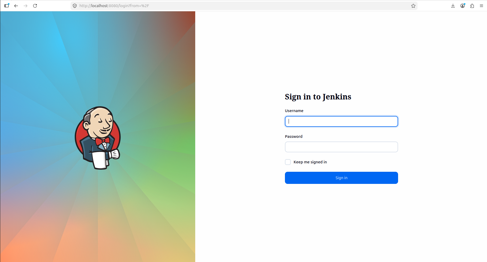
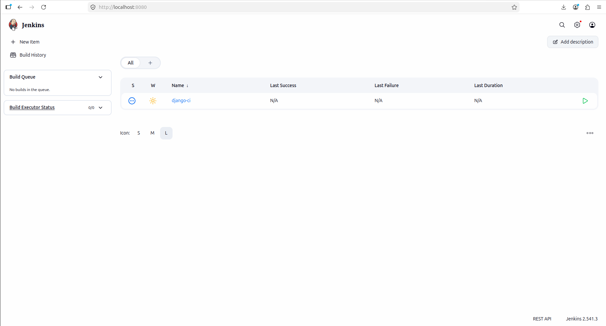
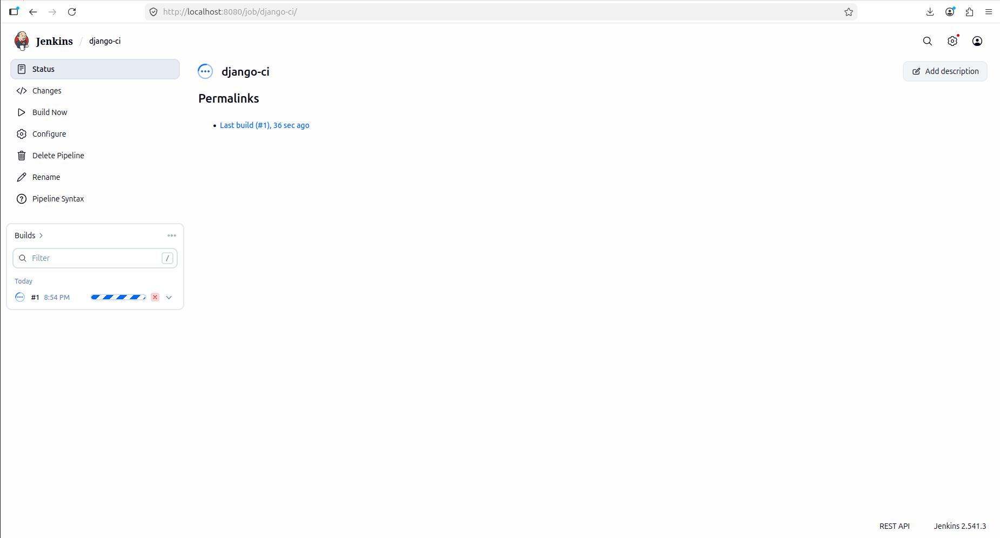
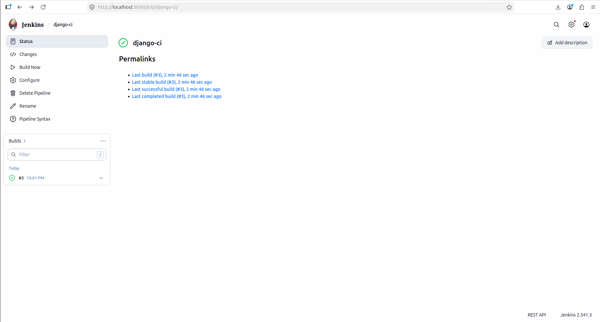
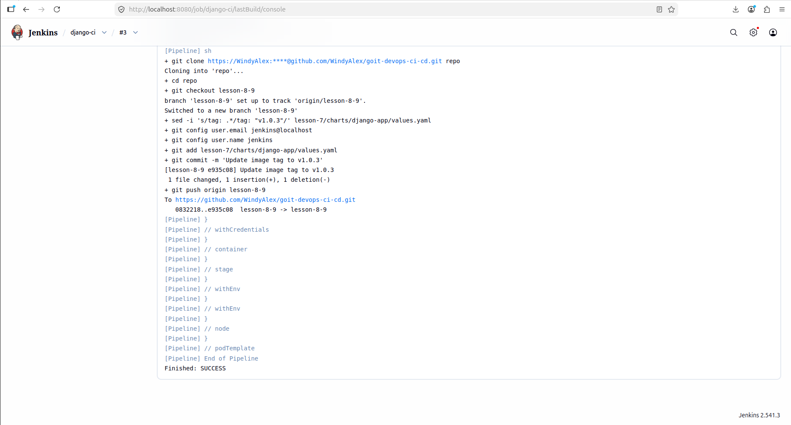
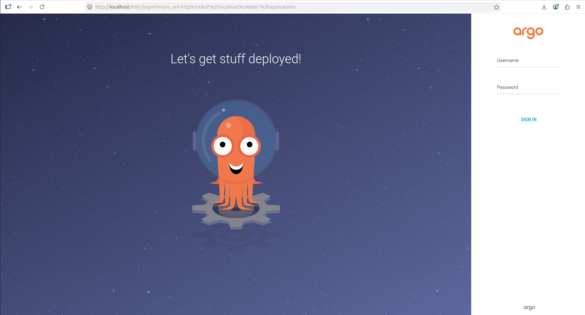
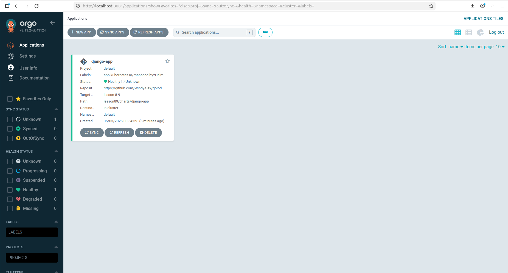
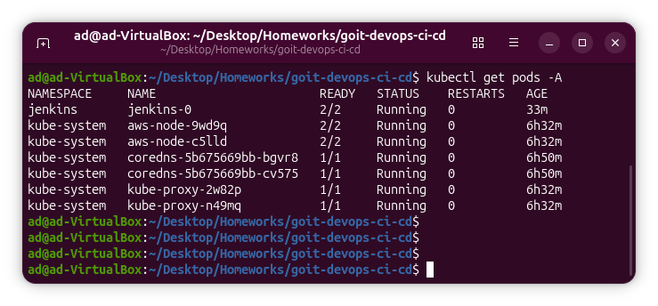

# DevOps CI/CD: Lesson 8-9 — Jenkins + ECR + Helm + Argo CD

## Мета

У цьому проєкті реалізовано CI/CD процес для Django-застосунку з використанням Jenkins, Kubernetes Agent, Kaniko, AWS ECR, Helm та Argo CD.

Pipeline автоматично:

- отримує код із GitHub;
- збирає Docker-образ через Kaniko;
- публікує Docker-образ в Amazon ECR;
- оновлює тег образу у Helm `values.yaml`;
- пушить зміни назад у GitHub.

---

## Використані технології

- Terraform
- AWS EKS
- AWS ECR
- Kubernetes
- Helm
- Jenkins
- Kaniko
- GitHub
- Argo CD

---

## Структура проєкту

```text
lesson89/
├── main.tf
├── outputs.tf
├── providers.tf
├── variables.tf
├── Jenkinsfile
├── modules/
    ├── jenkins/
    └── argo_cd/

lesson-7/
└── charts/
    └── django-app/
        ├── templates/
        ├── Chart.yaml
        └── values.yaml
```

## Запуск Terraform

```bash
terraform init
terraform apply
```

Після застосування Terraform створюються та налаштовуються:

- Jenkins у Kubernetes через Helm;
- Jenkins Kubernetes Agent;
- IAM роль для доступу Jenkins/Kaniko до ECR;
- Argo CD через Helm.

## Доступ до Jenkins

```bash
kubectl port-forward svc/jenkins 8080:8080 -n jenkins
```

Після цього Jenkins доступний за адресою:

```text
http://localhost:8080
```

## Jenkins Pipeline

Pipeline описаний у файлі:

```text
lesson89/Jenkinsfile
```

Основні етапи pipeline:

1. Build & Push Docker Image
   - збірка Docker-образу через Kaniko;
   - push образу в AWS ECR.
2. Update Chart Tag in Git
   - оновлення тегу образу у lesson-7/charts/django-app/values.yaml;
   - commit і push змін у гілку lesson-8-9.

## Docker Image

Образ збирається та публікується в AWS ECR:

```text
706243848287.dkr.ecr.eu-north-1.amazonaws.com/lesson-5-ecr:v1.0.3
```

## Доступ до Argo CD

Запуск port-forward:

```bash
kubectl port-forward svc/argo-cd-argocd-server 8081:443 -n argocd
```

Після цього Argo CD доступний за адресою:

```text
http://localhost:8081
```

## Argo CD Application

Argo CD підключений до Git-репозиторію та автоматично синхронізує застосунок.

Стан застосунку:

- Status: Healthy
- Sync: Synced

## Перевірка Kubernetes

```bash
kubectl get pods -A
```

## Скріншоти

Jenkins login:


Jenkins ci:


Jenkins process:


Jenkins success:


Jenkins console:


Argo login:


Argo page:


Kubectl pods:


## Висновок

У результаті було реалізовано повний CI/CD процес:

- Jenkins автоматично запускає pipeline
- Kaniko збирає Docker-образ без Docker daemon
- Образ публікується в Amazon ECR
- Helm chart автоматично оновлюється новим тегом
- Argo CD автоматично синхронізує застосунок
- Зміни пушаться назад у GitHub

Pipeline успішно завершився зі статусом SUCCESS.