# Фінальний проєкт DevOps на AWS

Проєкт демонструє повну DevOps-інфраструктуру в AWS з використанням Terraform, Kubernetes EKS, Jenkins, Argo CD, ECR, RDS, Prometheus і Grafana.

## Мета проєкту

Розгорнути інфраструктуру DevOps на AWS, яка включає:

- VPC з публічними та приватними підмережами;
- EKS Kubernetes cluster;
- ECR для Docker-образів Django-застосунку;
- RDS PostgreSQL або Aurora через універсальний Terraform-модуль;
- Jenkins для CI pipeline;
- Argo CD для GitOps-деплою Helm chart;
- Prometheus і Grafana для моніторингу;
- Django-застосунок, який розгортається в Kubernetes через Helm.

## Структура проєкту

```text
Project/
├── main.tf
├── backend.tf
├── providers.tf
├── variables.tf
├── outputs.tf
├── scripts/
│   └── bootstrap-backend.sh
├── modules/
│   ├── s3-backend/
│   ├── vpc/
│   ├── ecr/
│   ├── eks/
│   ├── rds/
│   ├── jenkins/
│   ├── argo_cd/
│   └── monitoring/
├── charts/
│   └── django-app/
│       ├── Chart.yaml
│       ├── values.yaml
│       └── templates/
│           ├── deployment.yaml
│           ├── service.yaml
│           ├── configmap.yaml
│           └── hpa.yaml
└── Django/
    ├── app/
    ├── Dockerfile
    ├── Jenkinsfile
    ├── docker-compose.yaml
    ├── manage.py
    ├── requirements.txt
    └── nginx/
        └── nginx.conf
```

## Основні компоненти

### VPC

Terraform створює окрему VPC з CIDR `10.0.0.0/16`, трьома публічними та трьома приватними підмережами. Для доступу з приватних підмереж використовується NAT Gateway, для публічного доступу — Internet Gateway.

### EKS

EKS cluster створюється через Terraform. Worker nodes запускаються у приватних підмережах. Для node group налаштовано IAM policies, включно з доступом до ECR та EBS CSI Driver.

### ECR

ECR repository створюється Terraform-модулем. Увімкнено:

- scan on push;
- AES256 encryption;
- lifecycle policy для збереження останніх 10 образів.

### RDS / Aurora

Модуль `rds` підтримує два режими:

- `use_aurora = false` — створюється звичайний RDS PostgreSQL instance;
- `use_aurora = true` — створюється Aurora cluster з writer instance.

Модуль також створює:

- DB Subnet Group;
- Security Group з доступом тільки всередині VPC;
- Parameter Group;
- backup retention period через змінну.

У фінальному запуску використано RDS PostgreSQL.

### Jenkins

Jenkins встановлюється через Helm за допомогою Terraform. Для CI використовується Kubernetes Agent з контейнерами Kaniko і Git.

Pipeline виконує такі кроки:

1. Перевіряє параметри.
2. Виконує `checkout scm`.
3. Збирає Docker-образ Django через Kaniko.
4. Публікує образ в ECR.
5. Оновлює `charts/django-app/values.yaml` з новим image tag.
6. Пушить зміни в Git з повідомленням `[skip ci]`, щоб уникнути нескінченного CI loop.

Jenkins використовує IRSA через OIDC, тому AWS access keys не зберігаються в репозиторії.

### Argo CD

Argo CD встановлюється через Helm за допомогою Terraform. Application створюється окремим Helm chart `argo-apps` і стежить за Helm chart Django-застосунку.

Для застосунку увімкнено автоматичну синхронізацію:

- `prune: true`;
- `selfHeal: true`;
- `CreateNamespace=true`.

### Helm chart Django-застосунку

Helm chart містить:

- Deployment;
- Service типу `LoadBalancer`;
- ConfigMap;
- HPA.

ConfigMap підключається до контейнера через `envFrom.configMapRef`.

HPA налаштований на масштабування від 2 до 6 pod при CPU utilization понад 70%.

### Monitoring

Prometheus і Grafana встановлюються через Helm за допомогою Terraform. Grafana має datasource Prometheus:

```text
http://prometheus-server.monitoring.svc.cluster.local
```

Для доступу до Grafana використовується port-forward.

## Змінні

Основні змінні передаються через `terraform.tfvars`, який не комітиться в Git:

```hcl
aws_region             = "eu-central-1"
project_name           = "final-devops"
github_username        = "..."
github_token           = "..."
git_repo_url           = "https://github.com/.../...git"
git_branch             = "final-project"
db_username            = "..."
db_password            = "..."
db_name                = "appdb"
use_aurora             = false
jenkins_admin_password = "..."
grafana_admin_password = "..."
```

Файл `.gitignore` виключає state-файли, `terraform.tfvars`, `.terraform/`, `.env`, кеш Python та інші локальні файли.

## Команди запуску

### 1. Ініціалізація backend

Якщо S3 bucket і DynamoDB table для Terraform backend ще не створені, їх можна створити через скрипт:

```bash
./scripts/bootstrap-backend.sh
```

### 2. Ініціалізація Terraform

```bash
terraform init
```

### 3. Перевірка плану

```bash
terraform plan
```

### 4. Розгортання інфраструктури

```bash
terraform apply
```

Після успішного запуску Terraform виводить команди для доступу до сервісів через port-forward.

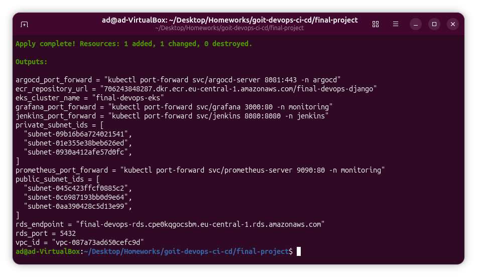

## Перевірка Kubernetes ресурсів

### Argo CD namespace

```bash
kubectl get all -n argocd
```

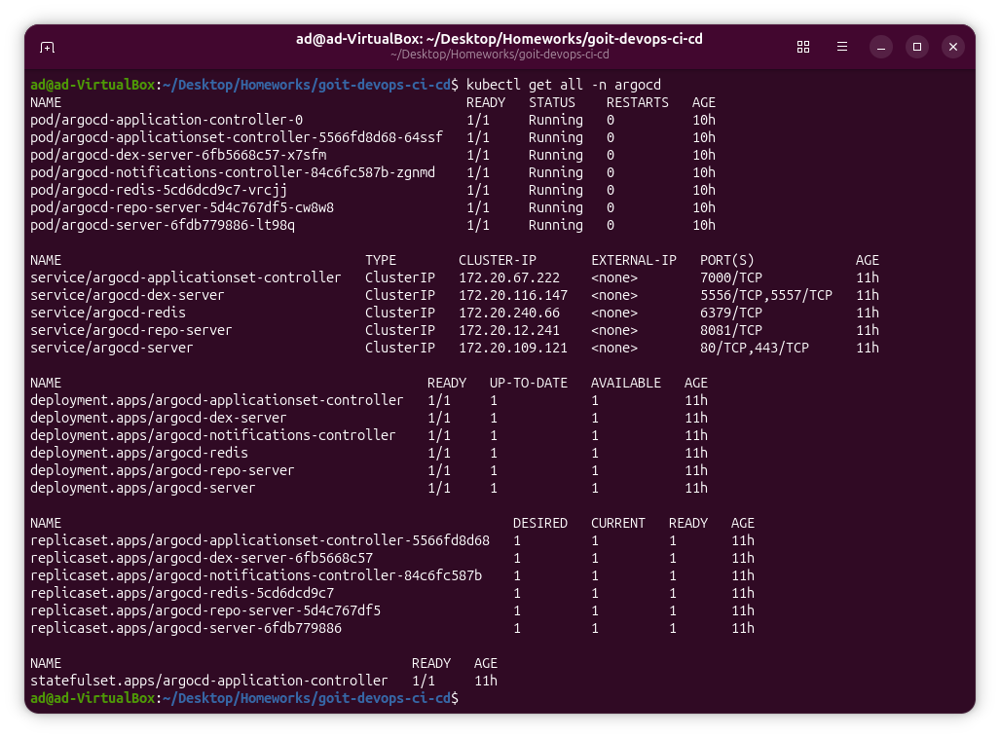

### Jenkins namespace

```bash
kubectl get all -n jenkins
```

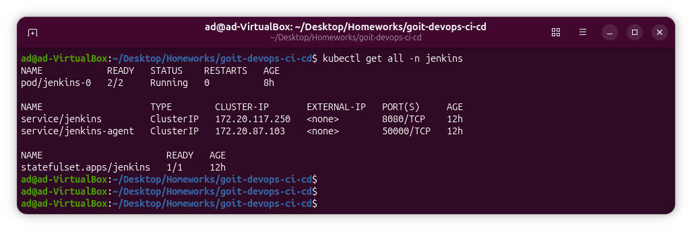

### Monitoring namespace

```bash
kubectl get all -n monitoring
```

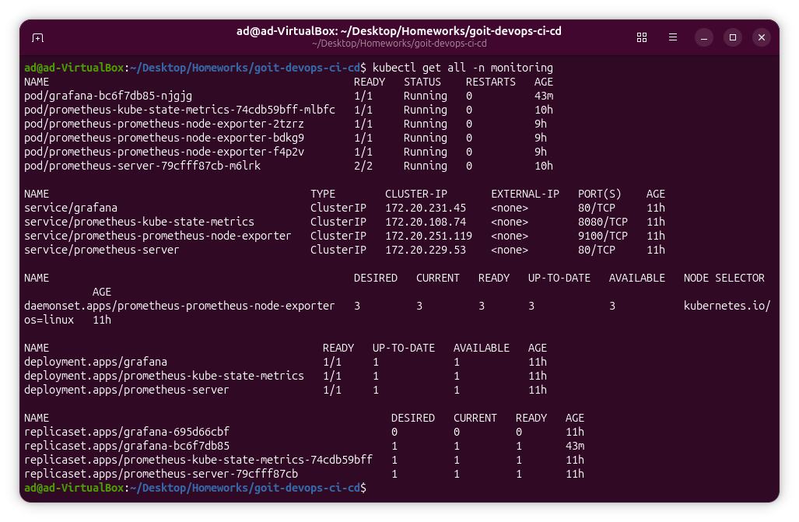

### Усі pod у кластері

```bash
kubectl get pods -A
```

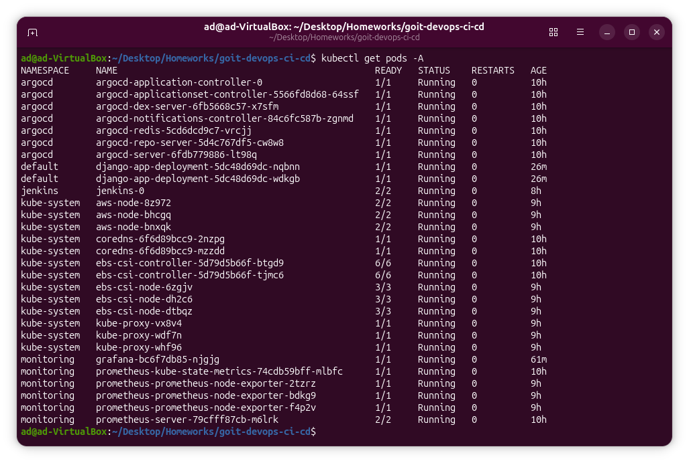

## Перевірка Jenkins

Для доступу до Jenkins:

```bash
kubectl port-forward svc/jenkins 8080:8080 -n jenkins
```

Після цього Jenkins доступний за адресою:

```text
http://localhost:8080
```

На скриншоті видно, що pipeline `django-ci` виконався успішно, останній build має статус success.

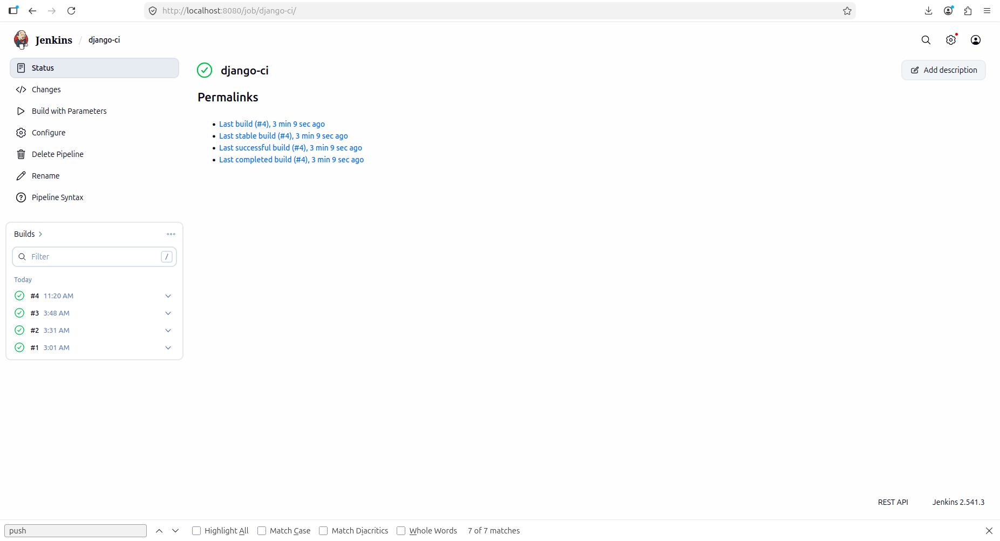

## Перевірка Argo CD

Для доступу до Argo CD:

```bash
kubectl port-forward svc/argocd-server 8081:443 -n argocd
```

Після цього Argo CD доступний за адресою:

```text
http://localhost:8081
```

Application `django-app` має статус `Healthy` і `Synced`, тобто Argo CD успішно синхронізував Helm chart із Git-репозиторію.

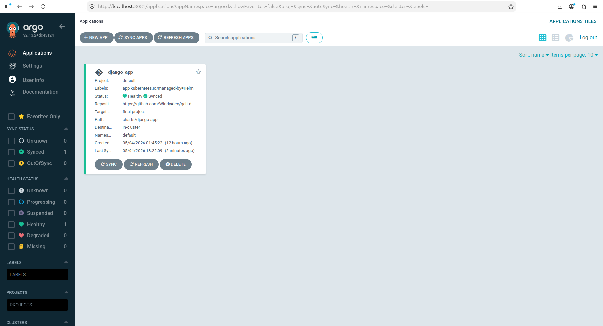

## Перевірка Grafana

Для доступу до Grafana:

```bash
kubectl port-forward svc/grafana 3000:80 -n monitoring
```

Після цього Grafana доступна за адресою:

```text
http://localhost:3000
```

На скриншоті показано dashboard Kubernetes cluster monitoring через Prometheus datasource.

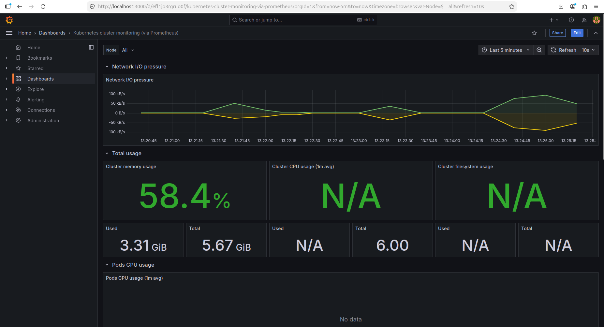

## Перевірка Prometheus

Для доступу до Prometheus:

```bash
kubectl port-forward svc/prometheus-server 9090:80 -n monitoring
```

Після цього Prometheus доступний за адресою:

```text
http://localhost:9090
```

## Примітка щодо backup retention period

У модулі RDS реалізовано змінну `backup_retention_period`. Спочатку було встановлено значення `7`, як у попередньому завданні для RDS-модуля.

```hcl
backup_retention_period = 7
```

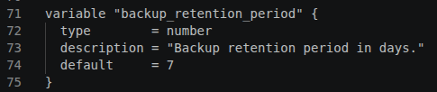

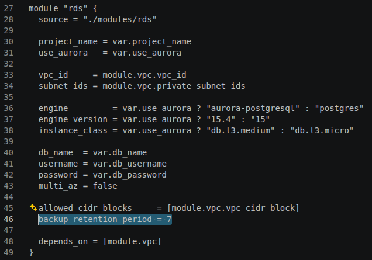

Однак AWS Free Tier account не дозволив застосувати це значення. Terraform повернув помилку `FreeTierRestrictionError`: вказаний backup retention period перевищує максимум, доступний для free tier customers.

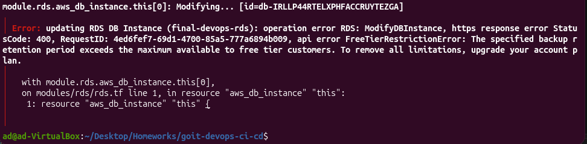

Тому для фінального запуску було встановлено:

```hcl
backup_retention_period = 1
```

Це технічне обмеження AWS-акаунта, а не відсутність реалізації в Terraform-модулі.

## CI/CD flow

```text
Developer push to GitHub
        ↓
Jenkins pipeline
        ↓
Kaniko builds Docker image
        ↓
Image pushed to Amazon ECR
        ↓
Jenkins updates Helm values.yaml with new image tag
        ↓
Jenkins pushes commit with [skip ci]
        ↓
Argo CD detects Git change
        ↓
Argo CD syncs Helm chart to EKS
        ↓
Django application runs in Kubernetes
        ↓
Prometheus collects metrics
        ↓
Grafana visualizes metrics
```

## Безпека

У проєкті реалізовано такі підходи:

- Terraform state зберігається в S3 з encryption enabled;
- DynamoDB використовується для state locking;
- секрети передаються через `terraform.tfvars`, який виключено з Git;
- GitHub token і паролі не зберігаються у відкритому коді;
- Jenkins використовує credentials і JCasC;
- Kaniko отримує доступ до ECR через IRSA та OIDC;
- RDS розміщено у приватних підмережах;
- RDS Security Group дозволяє доступ тільки з CIDR VPC;
- EKS worker nodes працюють у приватних підмережах;
- ECR має scan on push, encryption і lifecycle policy.

## Автомасштабування

У Helm chart реалізовано HPA:

```yaml
autoscaling:
  enabled: true
  minReplicas: 2
  maxReplicas: 6
  targetCPUUtilizationPercentage: 70
```

У Deployment поле `replicas` додається тільки тоді, коли autoscaling вимкнено. Це прибирає конфлікт між фіксованою кількістю replicas і HPA.

## Видалення ресурсів

Після перевірки потрібно видалити ресурси, щоб уникнути зайвих витрат в AWS:

```bash
terraform destroy
```

Важливо: якщо видаляється S3 bucket і DynamoDB table для backend, перед наступним запуском потрібно знову створити backend-ресурси через bootstrap-скрипт або вручну.
