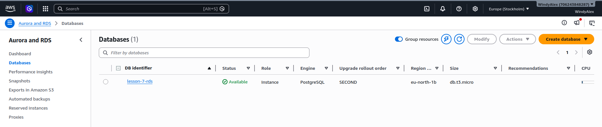
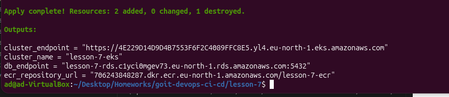

# Terraform DB Module (RDS / Aurora)

Цей проєкт розширює попередню інфраструктуру та додає універсальний Terraform-модуль для створення баз даних.

## Опис

Модуль `rds` у папці `lesson-7` дозволяє створювати:

- Звичайну RDS базу (PostgreSQL / MySQL)
- Aurora кластер (PostgreSQL / MySQL)

Тип бази визначається змінною:

use_aurora = true | false

---

## Приклад використання

```hcl
module "rds" {
  source = "./modules/rds"

  project_name = var.project_name

  use_aurora = false

  vpc_id     = var.vpc_id
  subnet_ids = var.private_subnet_ids

  engine         = "postgres"
  engine_version = "15"
  instance_class = "db.t3.micro"

  db_name  = "appdb"
  username = var.db_username
  password = var.db_password

  multi_az = false
}
```

---

## Як увімкнути Aurora

```hcl
use_aurora     = true
engine         = "aurora-postgresql"
engine_version = "15.4"
```

---

## Що створює модуль

В обох випадках:

- DB Subnet Group
- Security Group
- Parameter Group

Додатково:

- RDS → aws_db_instance
- Aurora → aws_rds_cluster + aws_rds_cluster_instance

---

## Вхідні змінні

| Змінна | Опис |
|------|------|
| project_name | Префікс для ресурсів |
| use_aurora | Перемикає тип БД |
| vpc_id | ID VPC |
| subnet_ids | Список приватних підмереж |
| engine | Тип бази даних |
| engine_version | Версія БД |
| instance_class | Тип інстансу |
| db_name | Назва бази |
| username | Користувач БД |
| password | Пароль БД |
| multi_az | Відмовостійкість |

---

## Outputs

| Output | Опис |
|------|------|
| db_endpoint | Endpoint бази |
| db_port | Порт |
| db_security_group_id | Security Group |

---

## Скріншоти

### AWS RDS



---

### Terraform Output



---

## Команди

```bash
terraform init
terraform validate
terraform plan
terraform apply
```