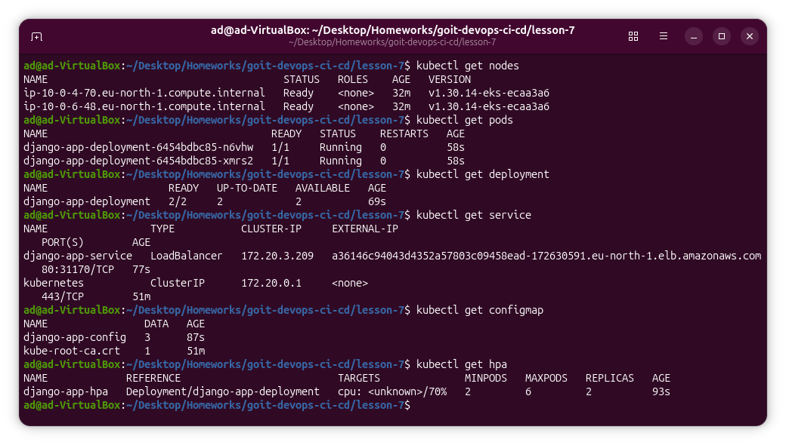

DevOps CI/CD: hw7

# Lesson 7 — Kubernetes (EKS) + Helm + ECR

## Мета

У цьому проєкті реалізовано повний цикл розгортання застосунку в AWS:

- створення Kubernetes-кластера (EKS) через Terraform  
- використання ECR для зберігання Docker-образу  
- деплой застосунку через Helm  
- налаштування автоскейлінгу (HPA)  
- використання ConfigMap для змінних середовища  

---

## Використані технології

- Terraform
- AWS EKS
- AWS ECR
- Docker
- Kubernetes
- Helm

---

## Структура проєкту

```
lesson-7/
├── main.tf
├── backend.tf
├── outputs.tf
├── providers.tf
├── variables.tf
├── terraform.tfvars
│
├── modules/
│ ├── eks/
│ └── ecr/
│
└── charts/
  └── django-app/
  ├── templates/
  │ ├── deployment.yaml
  │ ├── service.yaml
  │ ├── configmap.yaml
  │ └── hpa.yaml
  ├── Chart.yaml
  └── values.yaml
```

## Опис команд

- **Terraform** — створення інфраструктури (EKS)
- **Docker** — збірка та пуш образу в ECR
- **Helm** — деплой застосунку в Kubernetes
- **kubectl** — перевірка стану ресурсів

## Запуск проєкту

### 1. Terraform

```bash
terraform init
terraform validate
terraform plan
terraform apply
```

### 2. Підключення до кластера

```bash
aws eks update-kubeconfig --region eu-north-1 --name lesson-7-eks
kubectl get nodes
```

### 3. Docker + ECR

```bash
docker build -t django-app ./django-app
docker tag django-app:latest $(cd lesson-7 && terraform output -raw ecr_repository_url):latest
docker push $(cd lesson-7 && terraform output -raw ecr_repository_url):latest
```

### 4. Helm

```bash
helm lint ./charts/django-app
helm upgrade --install django-app ./charts/django-app \
  --set image.repository=$(terraform output -raw ecr_repository_url)
```

### 5. Перевірка

```bash
kubectl get pods
kubectl get deployment
kubectl get service
kubectl get configmap
kubectl get hpa
```

### 6. Результат

