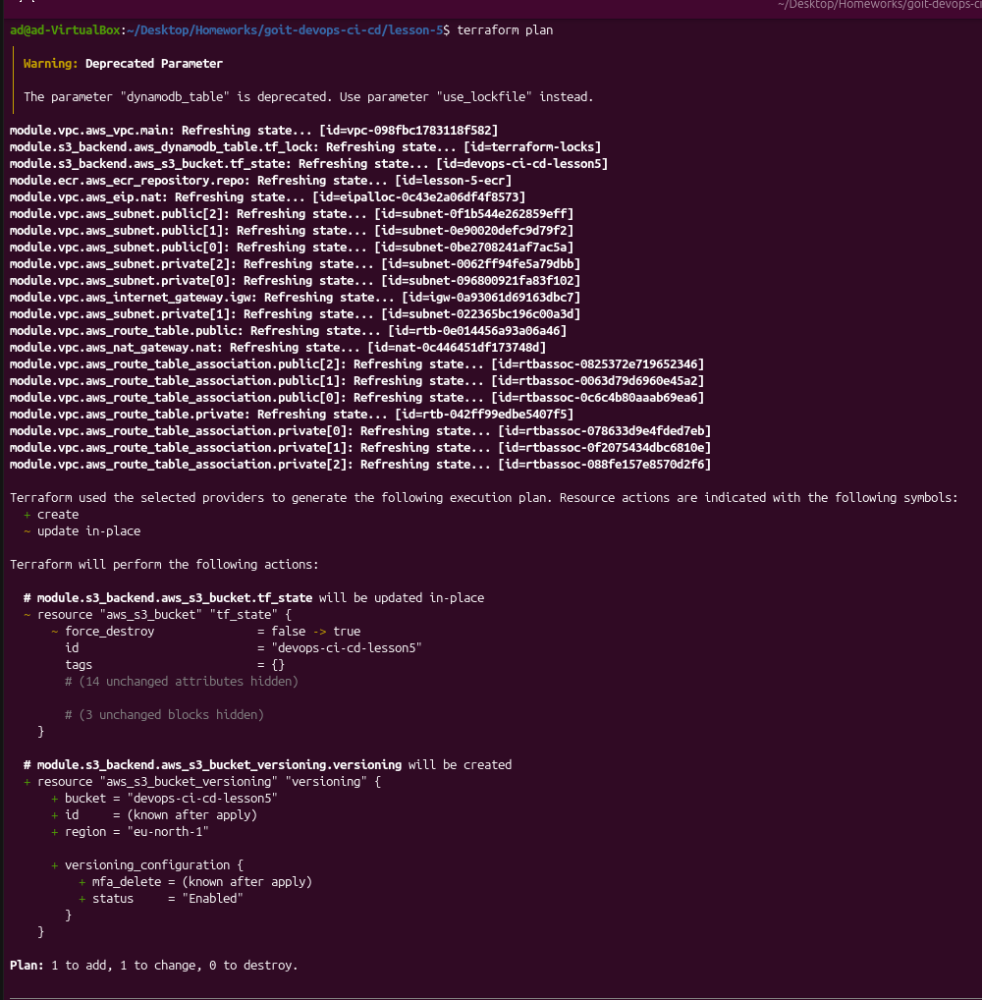
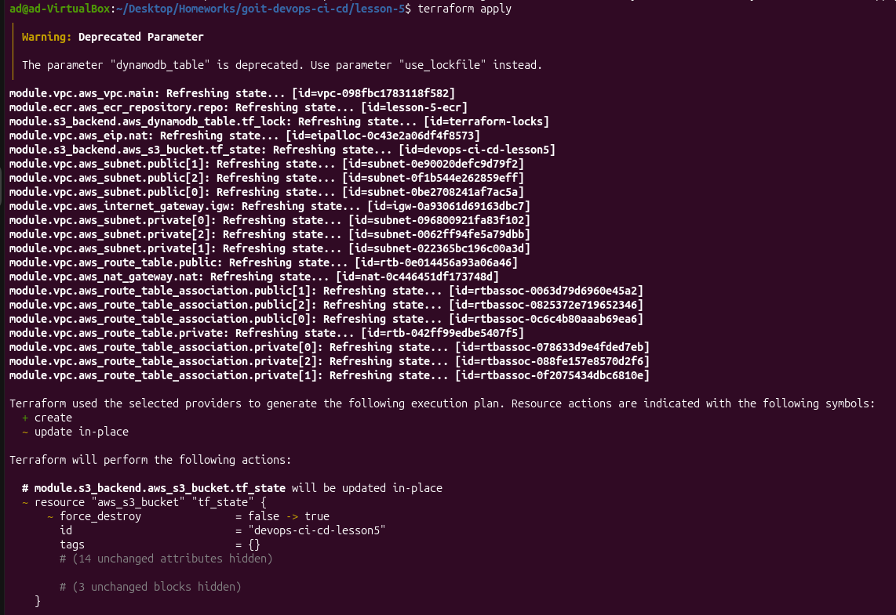
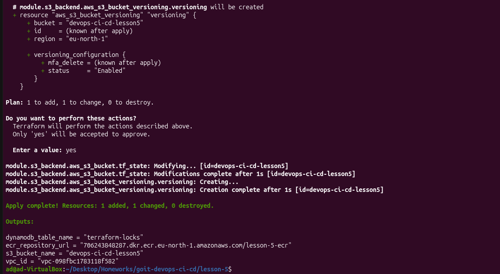
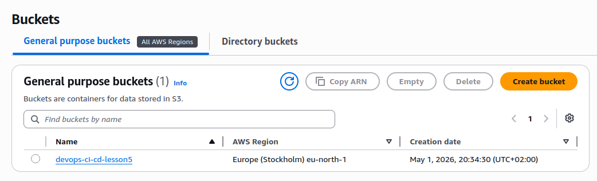
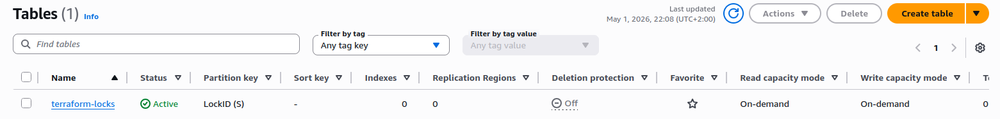
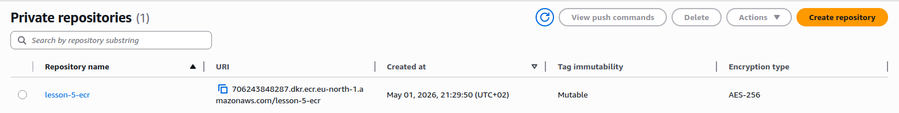
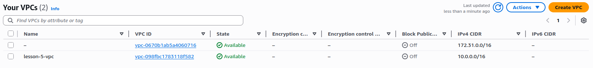
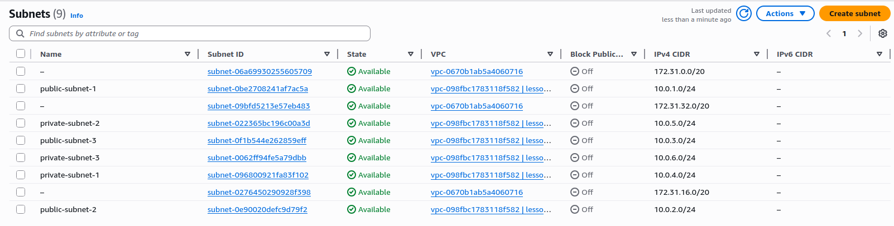

DevOps CI/CD: hw5

# Lesson 5: Infrastructure as Code (Terraform)

## 📌 Description

This project demonstrates Infrastructure as Code (IaC) using Terraform to deploy AWS infrastructure.

The following components are implemented:

- Remote state storage using S3
- State locking using DynamoDB
- VPC with public and private subnets
- ECR repository for Docker images

---

## 🏗 Project Structure
lesson-5/
│
├── main.tf
├── backend.tf
├── outputs.tf
│
└── modules/
  ├── s3-backend/
  ├── vpc/
  └── ecr/


---

## ⚙️ Modules

### 🔹 s3-backend
- Creates S3 bucket for Terraform state
- Enables versioning
- Creates DynamoDB table for state locking

---

### 🔹 vpc
- Creates VPC (10.0.0.0/16)
- 3 public subnets
- 3 private subnets
- Internet Gateway
- NAT Gateway
- Route tables

---

### 🔹 ecr
- Creates ECR repository
- Enables image scan on push

---

## 🚀 Commands

```bash
terraform init
terraform validate
terraform plan
terraform apply
terraform destroy

## Screenshots

### Terraform Plan


### Terraform Apply



### S3 Bucket


### DynamoDB Table


### ECR Repository


### VPC


### Subnets

